# PintOps

> Pipeline de datos para la **prueba técnica de Alten** (perfil Data Engineer).

Con el Mundial, todos van al bar — y las cervecerías se preparan: más stock,
más pedidos, más datos. **PintOps** es un pipeline que alimenta un catálogo vivo
de cervecerías para análisis de mercado: cuántas hay, dónde están, de qué tipo
son y cómo contactarlas. La fuente elegida es [Open Brewery DB](https://www.openbrewerydb.org/),
una API pública sin autenticación que devuelve cervecerías de todo el mundo en
JSON paginado: el tipo de proveedor externo no controlado, con datos
heterogéneos y sin SLA garantizado, que aparece en cualquier proyecto real.

El pipeline ingesta 100+ registros, los carga crudos en **Google BigQuery** y
los transforma con **SQL idempotente** hacia una tabla de integración. La
infraestructura está como código con **Terraform** y se valida con **CI en
GitHub Actions**.

> ⚠️ **Sobre Airflow:** el enunciado pide un DAG de Airflow como **ejercicio de
> orquestación independiente**. En PintOps, Airflow **no** orquesta el flujo
> productivo de carga Python → BigQuery → SQL; es un módulo aparte que responde a
> esa parte del enunciado (ver `dags/test.py` y el diagrama de arquitectura).

## Arquitectura

```mermaid
flowchart TD
  subgraph data["Pipeline de datos (productivo)"]
    API["Open Brewery DB<br/>API pública · JSON paginado"]
    PY["Python · ingestion<br/>api_client.py · main.py"]
    RAW[("BigQuery · raw<br/>SANDBOX_alten_pipeline.raw_breweries")]
    SQL["SQL idempotente<br/>transform.sql"]
    INT[("BigQuery · integration<br/>INTEGRATION.integration_prueba_tecnica")]
    API -->|HTTP + reintentos| PY
    PY -->|WRITE_TRUNCATE| RAW
    RAW --> SQL
    SQL -->|CREATE OR REPLACE · dedup brewery_id| INT
  end

  subgraph airflow["Orquestación Airflow · ejercicio independiente"]
    DAG["DAG test · diario 03:00 UTC<br/>dependencias par/impar + operador TimeDiff"]
  end

  subgraph infra["Infraestructura y validación"]
    TF["Terraform<br/>datasets · tablas · SA · IAM · state en GCS"]
    CI["CI · GitHub Actions<br/>pytest · ruff · terraform validate"]
  end

  TF -.provisiona.-> RAW
  TF -.provisiona.-> INT
```



> El subgraph de **Airflow** no tiene flechas hacia el pipeline: es deliberado.
> Es un ejercicio aparte del enunciado, no el orquestador del flujo de carga.

| Capa | Componente | Qué hace |
|------|------------|----------|
| Ingesta | `src/alten_pipeline/api_client.py` | Descarga paginada con reintentos; normaliza y agrega trazabilidad (`run_id`, `ingestion_ts`, `source_payload`). |
| Carga | `src/alten_pipeline/bq_uploader.py` | Carga en `SANDBOX_alten_pipeline.raw_breweries` con `WRITE_TRUNCATE` (cada corrida es autocontenida e idempotente). |
| Orquestación CLI | `src/alten_pipeline/main.py` | Punto de entrada CLI: descarga → asegura dataset → carga. |
| Transformación | `sql/transform.sql` | `CREATE OR REPLACE TABLE` raw → `INTEGRATION.integration_prueba_tecnica`: dedup por `brewery_id` (gana la ingesta más reciente) y `transformation_date = DATE(ingestion_ts)`. |
| Orquestación Airflow *(ejercicio aparte)* | `dags/test.py` | DAG `test` diario (03:00 UTC) con dependencias par/impar y operador `TimeDiff`. **No** invoca el pipeline de carga; responde a la parte de orquestación del enunciado. |
| Infraestructura | `terraform/` | Datasets, tablas, Service Account y permisos mínimos en GCP. |
| Validación | `.github/workflows/ci.yml` | CI: pytest, ruff, `terraform fmt/validate`. |

## Cómo ejecutar

### Requisitos

- Python **3.11+** gestionado con [`uv`](https://docs.astral.sh/uv/)
- Una cuenta de GCP con BigQuery habilitado y credenciales locales
- Docker (solo para Airflow local)

### 1. Pipeline de ingesta (Python)

```bash
# Instalación
uv sync --all-extras

# Credenciales de GCP (una de las dos opciones)
gcloud auth application-default login
# o: definir GOOGLE_APPLICATION_CREDENTIALS en .env (ver .env.example)

# Definir el proyecto destino (obligatorio para la carga real)
cp .env.example .env      # y editar BQ_PROJECT=...

# Ejecutar la corrida
uv run python -m alten_pipeline.main
```

### 2. Transformación SQL (idempotente)

```bash
bq query --use_legacy_sql=false < sql/transform.sql
```

Re-ejecutar sobre los mismos datos crudos produce siempre el mismo resultado: `transformation_date` se deriva del dato (`DATE(ingestion_ts)`), no de `CURRENT_DATE()`.

### 3. Airflow local

```bash
docker compose up -d
# Web UI: http://localhost:8080  (airflow / airflow)
docker compose down -v        # detener y borrar la BD local
```

### 4. Terraform

```bash
cd terraform
terraform init -backend-config="bucket=alten-case-terraform-state"
terraform plan
terraform apply          # manual: ver sección CI vs CD
```

### 5. CI local (lo mismo que corre GitHub Actions)

```bash
uv run pytest -q && uv run ruff check .
terraform -chdir=terraform fmt -recursive -check
terraform -chdir=terraform validate
```

## Variables de entorno

Definir copiando `.env.example` a `.env`. Ninguna contiene secretos; las credenciales de GCP se inyectan vía `gcloud` o `GOOGLE_APPLICATION_CREDENTIALS`.

| Variable | Obligatoria | Default | Descripción |
|----------|-------------|---------|-------------|
| `BQ_PROJECT` | **Sí** (para cargar) | — | Proyecto de GCP destino. |
| `BQ_DATASET` | No | `SANDBOX_alten_pipeline` | Dataset de la capa cruda. |
| `BQ_TABLE` | No | `raw_breweries` | Tabla destino de los registros crudos. |
| `BQ_LOCATION` | No | `US` | Ubicación geográfica del dataset. El valor por defecto del código es `US` (histórico); para esta prueba se usa y recomienda `europe-west1` (ver `.env`). |
| `GOOGLE_APPLICATION_CREDENTIALS` | No | — | Ruta al JSON de la Service Account. |
| `API_BASE_URL` | No | API oficial de Open Brewery DB | URL base del endpoint. |
| `API_PER_PAGE` | No | `50` | Registros por página (máx. 200). |
| `API_TIMEOUT_SECONDS` | No | `30` | Timeout HTTP por solicitud. |
| `API_MAX_RETRIES` | No | `3` | Reintentos ante 5xx / 429 / timeout. |
| `API_MAX_RECORDS` | No | `100` | Máximo de registros por corrida (`0` = todo). |
| `LOG_LEVEL` | No | `INFO` | Nivel de logging. |

## CI vs CD

El workflow de GitHub Actions (`.github/workflows/ci.yml`) es **solo de validación (CI)**: corre tests, linter y `terraform validate`. **No** hace `terraform apply` ni despliega a GCP automáticamente.

La razón es de seguridad: cualquier `apply` contra infraestructura real queda como **paso manual y protegido**. Un futuro CD separado requerirá secretos de GCP y un modelo de aprobación explícito.

## Estructura del repositorio

```
alten-case/
├── src/alten_pipeline/    # Pipeline Python: api_client, bq_uploader, config, main
├── tests/                 # pytest (tests estructurales de Terraform incluidos)
├── sql/transform.sql      # Transformación idempotente raw → integration
├── dags/test.py           # DAG de Airflow
├── terraform/             # Infraestructura como código (BigQuery + Service Account)
├── .github/workflows/     # CI
├── docker-compose.yml     # Airflow local
└── pyproject.toml         # Configuración del proyecto y herramientas
```

## Recursos

- **Repositorio:** https://github.com/Alejbc27/alten-case
- **API:** https://www.openbrewerydb.org/
- **Detalles de Terraform y CI:** [`terraform/README.md`](terraform/README.md) y [`.github/workflows/ci.yml`](.github/workflows/ci.yml)
